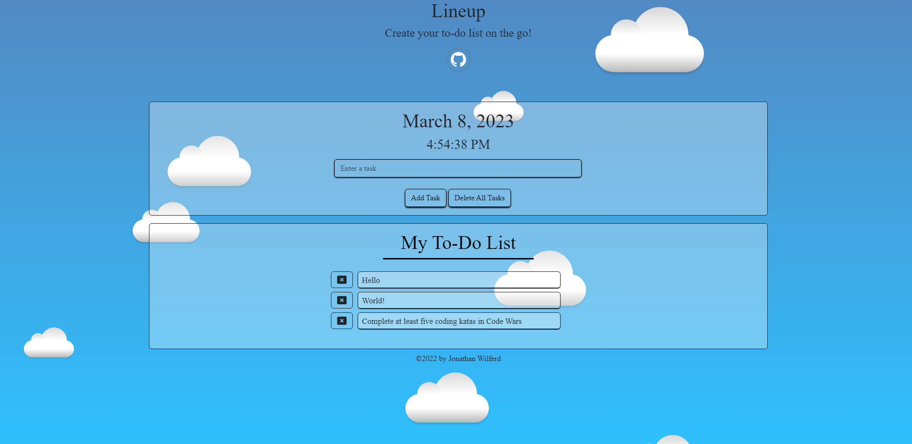
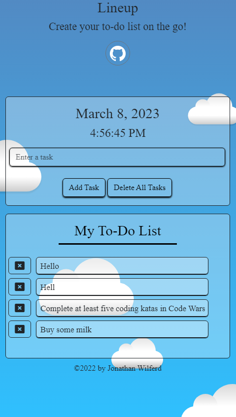

# Lineup

:computer: **Live Deployment:** https://jwilferd10.github.io/Lineup/

:computer: **Github Repository:** https://github.com/jwilferd10/Lineup

## :open_file_folder: Table of Contents:
  - [Preview](#camera-preview)
  - [Demo](#movie_camera-demo)
  - [Description](#wave-description)
  - [User Story](#book-user-story)
  - [Resources Used](#floppy_disk-resources-used)
  - [Installation](#minidisc-installation-and-usage)
  - [Contributors](#paperclip-contributors)
  - [Contact Information](#e-mail-contact-information)

## :camera: Preview:

  
  

## :movie_camera: Demo:

## :wave: Description: 

 
Lineup is an application that allows users to create and add to a to-do list. Users can delete either one list item or all of them together. Additionally users are presented with the current date and active time. Lineup was brought to life through Bootstrap, CSS, jQuery, JavaScript and FontAwesome! 

This project was put together to practice and reinforce concepts that I've learned while at the same time creating a simple but usable application. Since the goal of this project was to improve, I decided to avoid using a CDN like momentJS and used JavaScript's Date object to collect both the time and date instead. 

It's my hope this application helps you out in anyway possible. Happy Coding!

  
## :book: User Story:
**AS A user with a busy day**
- I WANT a To-Do List Application 
- SO THAT I can keep on top of my list

**GIVEN I need a To-Do List**
- WHEN I open the app
	- THEN I am presented with a form and a list
- WHEN I enter my task
	- THEN my list updates with said task
- WHEN I delete a single task
	- THEN that task is removed from the list
- WHEN I delete all tasks
	- THEN my list becomes clear 

## :floppy_disk: Resources Used:
Main Resources:
- HTML
- CSS
- Bootstrap 5.3.0
- JavaScript
- jQuery
- FontAwesome

## :minidisc: Installation and Usage:
### Install:
- You can do this by clicking the *GREEN* button above and you can download it by ZIP or copy the SSH!
### Usage:

## :paperclip: Contributors

- jwilferd10

## :e-mail: Contact Information:
- ### [jwilferd10](https://github.com/jwilferd10)
